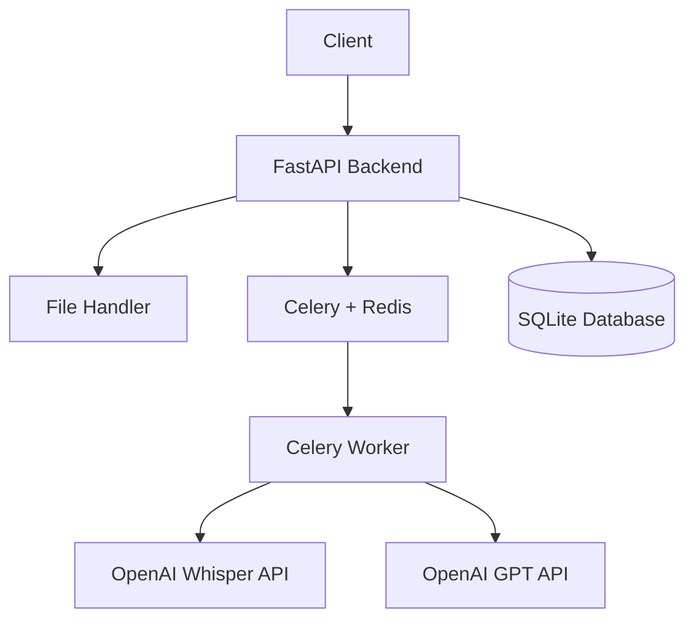

# Design Document

## Overview

The Audio Transcription Summarizer is a simple web-based application that processes MP3 audio files to generate both full transcriptions and concise summaries. The system uses a Python FastAPI backend with OpenAI's Whisper API for speech-to-text conversion and OpenAI's GPT models for text summarization.

The application provides a RESTful API that accepts MP3 file uploads, processes them asynchronously through a task queue, and returns structured results to the client.

## Architecture

### High-Level Architecture



### Technology Stack

**Backend Framework:**
- FastAPI for REST API development
- Python 3.9+ for core application logic
- Pydantic for data validation and serialization

**AI Services:**
- OpenAI Whisper API for speech-to-text transcription
- OpenAI GPT API for text summarization

**Infrastructure:**
- Task Queue: Celery with Redis for asynchronous processing
- Database: SQLite for job tracking and results storage
- File Storage: Local filesystem for temporary file handling

## Components and Interfaces

### 1. API Layer (`app/main.py`)

**Core Endpoints:**
```python
POST /upload - Upload MP3 file for processing
GET /status/{job_id} - Check processing status
GET /result/{job_id} - Retrieve transcription and summary
```

**Request/Response Models:**
```python
class UploadResponse(BaseModel):
    job_id: str
    status: str

class ProcessingResult(BaseModel):
    job_id: str
    status: str
    transcription: Optional[str]
    summary: Optional[str]
    error_message: Optional[str]
```

### 2. File Handler (`app/services/file_handler.py`)

**Responsibilities:**
- Validate MP3 file format and size
- Store uploaded files temporarily
- Clean up files after processing

### 3. Transcription Service (`app/services/transcription.py`)

**Responsibilities:**
- Interface with OpenAI Whisper API
- Handle transcription errors

**Key Method:**
```python
def transcribe_audio(file_path: str) -> str
```

### 4. Summarization Service (`app/services/summarization.py`)

**Responsibilities:**
- Generate summaries using OpenAI GPT API
- Handle summarization errors

**Key Method:**
```python
def summarize_text(text: str) -> str
```

### 5. Task Processing (`app/workers/tasks.py`)

**Celery Worker:**
```python
@celery.task
def process_audio_file(job_id: str, file_path: str) -> dict
```

**Processing Pipeline:**
1. Audio transcription via Whisper API
2. Text summarization via GPT API
3. Result storage in database
4. File cleanup

## Data Models

### Database Schema (`app/models.py`)

**ProcessingJob Table:**
```python
class ProcessingJob(SQLAlchemyBase):
    id: str (Primary Key, UUID)
    filename: str
    status: str (pending, processing, completed, failed)
    transcription: Optional[Text]
    summary: Optional[Text]
    error_message: Optional[str]
    created_at: datetime
```

## Error Handling

### Basic Error Types
- File validation errors (invalid format, size limits)
- API service failures (Whisper, GPT)
- Database errors
- Task processing failures

### Error Response Format
```python
class ErrorResponse(BaseModel):
    error_message: str
    job_id: Optional[str]
```

## Testing Strategy

### Essential Testing
- Unit tests for core services (transcription, summarization)
- API endpoint testing
- Basic integration tests for the processing pipeline

### Testing Framework
- pytest for test execution
- unittest.mock for API mocking

## Configuration

### Environment Variables
```python
OPENAI_API_KEY = "sk-..."
REDIS_URL = "redis://localhost:6379"
DATABASE_URL = "sqlite:///./app.db"
UPLOAD_DIR = "./uploads"
```